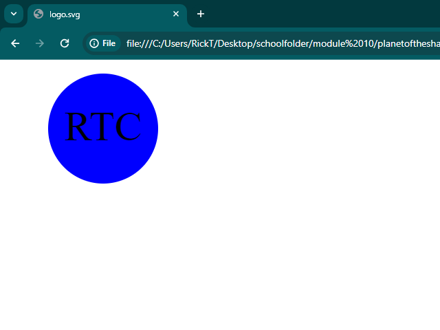

# SVG LOGO GENERATOR

## Description

This app generates an SVG file from the prompt. Just answer a few simple questions and it will generate a logo for you.

## Table of Contents

- [Installation](#installation)
- [Usage](#usage)
- [Credits](#credits)
- [License](#license)
- [Links](#links)

## Installation

All you need is vs code and any browser that support svg files.

## Usage

If you need to generate a logo you can utilize this application to help with that. 

    
    

## Credits

BCS, W3 Schools, Mozilla MDN, Stack Overflow, My Instructor Luigi Campbell

## License

NO license

## Links

Link to Repository: https://github.com/rtocastro/planetoftheshapes

Link to demo: https://www.youtube.com/watch?v=CGuGcLKlNvY

## Tests

To run a test on the suites simply type in "npm test" into the terminal.